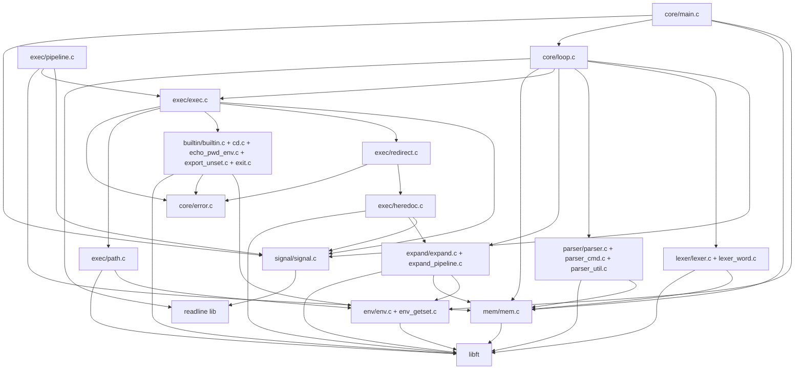
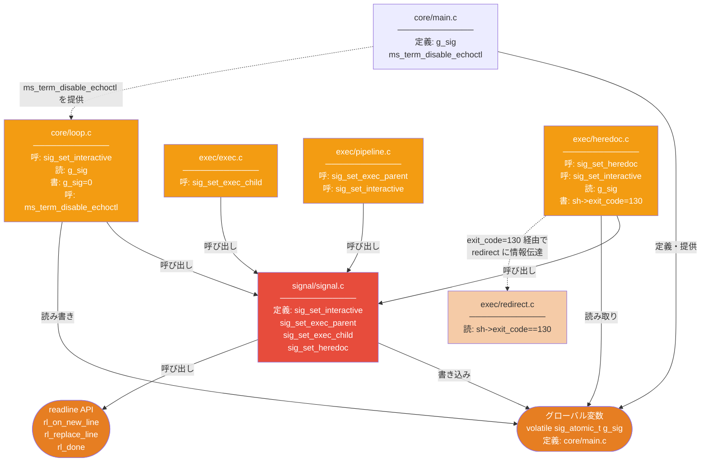
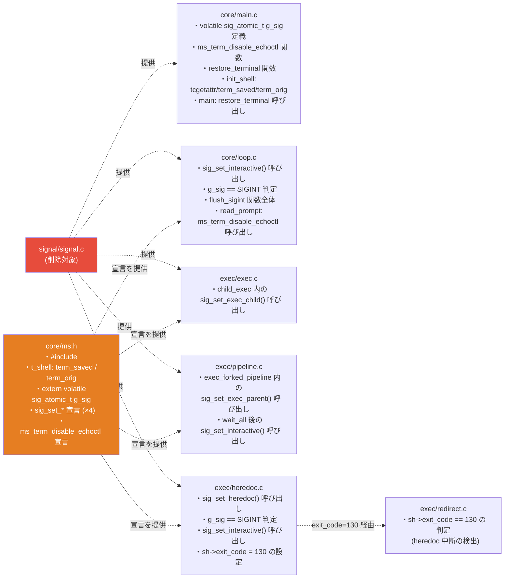

# minishell/claude — モジュール間依存関係

> 現在のコード (`src/` 以下) を対象に、**呼び出す関数・読み書きするグローバル変数・アクセスする構造体フィールド**の粒度で記述する。

---

## 目次

1. [モジュール一覧](#1-モジュール一覧)
2. [依存グラフ (概要)](#2-依存グラフ-概要)
3. [依存グラフ (signal 系を分離)](#3-依存グラフ-signal-系を分離)
4. [ファイル別 詳細依存表](#4-ファイル別-詳細依存表)
   - [core/main.c](#coremainc)
   - [core/loop.c](#coreloop)
   - [signal/signal.c](#signalsignalc)
   - [exec/exec.c](#execexecc)
   - [exec/pipeline.c](#execpipelinec)
   - [exec/redirect.c](#execredirectc)
   - [exec/heredoc.c](#execheredocc)
   - [exec/path.c](#execpathc)
   - [expand/expand.c](#expandexpandc)
   - [expand/expand_pipeline.c](#expandexpand_pipelinec)
   - [lexer/lexer.c](#lexerlexerc)
   - [lexer/lexer_word.c](#lexerlexer_wordc)
   - [parser/parser.c](#parserparserc)
   - [parser/parser_cmd.c](#parserparsercmdc)
   - [parser/parser_util.c](#parserparserutilc)
   - [env/env.c](#envenvc)
   - [env/env_getset.c](#envenv_getsetc)
   - [mem/mem.c](#memmemc)
   - [builtin/builtin.c](#builtinbuiltinc)
   - [builtin/cd.c](#builtincdc)
   - [builtin/echo_pwd_env.c](#builtinecho_pwd_envc)
   - [builtin/export_unset.c](#builtinexport_unsetc)
   - [builtin/exit.c](#builtinexitc)
   - [core/error.c](#coreerrorc)
5. [グローバル変数・共有状態の依存](#5-グローバル変数共有状態の依存)
6. [signal モジュールに依存している箇所の一覧](#6-signal-モジュールに依存している箇所の一覧)

---

## 1. モジュール一覧

| ディレクトリ | ファイル | 役割 |
|---|---|---|
| `core/` | `main.c` | エントリポイント、グローバル `g_sig` 定義、端末初期化 |
| `core/` | `loop.c` | メインループ、readline 入力、シグナルフラグ検査 |
| `core/` | `error.c` | `ms_perror` |
| `signal/` | `signal.c` | シグナルハンドラ登録、`g_sig` 書き込み、readline 状態制御 |
| `env/` | `env.c` | 環境変数テーブルの初期化・解放・拡張 |
| `env/` | `env_getset.c` | 環境変数の検索・追加・削除 |
| `mem/` | `mem.c` | アリーナアロケータ (alloc / mark / pop / strdup) |
| `lexer/` | `lexer.c` | 文字列 → トークン列 |
| `lexer/` | `lexer_word.c` | ワード境界検出 (クォート追跡) |
| `parser/` | `parser.c` | トークン列 → `t_pipeline` |
| `parser/` | `parser_cmd.c` | `t_cmd` 配列と `t_redirect` リストの構築 |
| `parser/` | `parser_util.c` | `has_quote` / `is_redirect` / `map_redirect` |
| `expand/` | `expand.c` | `$VAR`・`$?`・クォート処理 (`expand_word`, `strip_quotes`) |
| `expand/` | `expand_pipeline.c` | パイプライン全体への展開適用 |
| `exec/` | `exec.c` | `child_exec`, `exec_single_parent`, `exec_pipeline` |
| `exec/` | `pipeline.c` | fork/pipe ループ、`wait_all`, `exec_forked_pipeline` |
| `exec/` | `redirect.c` | ファイルオープン・`dup2` 適用 |
| `exec/` | `heredoc.c` | heredoc 入力読み取り・パイプ生成 |
| `exec/` | `path.c` | PATH 検索 |
| `builtin/` | `builtin.c` | builtin ディスパッチャ |
| `builtin/` | `cd.c` | `cd` |
| `builtin/` | `echo_pwd_env.c` | `echo` / `pwd` / `env` |
| `builtin/` | `export_unset.c` | `export` / `unset` |
| `builtin/` | `exit.c` | `exit` |

---

## 2. 依存グラフ (概要)

---

## 3. 依存グラフ (signal 系を分離)

signal モジュールおよびそこへの依存だけを抽出して色分けする。

---

## 4. ファイル別 詳細依存表

---

### `core/main.c`

**提供するシンボル**

| シンボル | 種別 | 備考 |
|---|---|---|
| `g_sig` | グローバル変数定義 | `volatile sig_atomic_t`、extern 宣言は ms.h |
| `ms_term_disable_echoctl(t_shell *)` | 関数定義 | ECHOCTL フラグを無効化 |

**依存先**

| 呼び出し / アクセス | 依存先モジュール |
|---|---|
| `env_init(&sh->env, envp)` | `env/env.c` |
| `env_free(&sh.env)` | `env/env.c` |
| `mem_init(&sh->mem)` | `mem/mem.c` |
| `mem_reset(&sh.mem)` | `mem/mem.c` |
| `ms_loop(&sh)` | `core/loop.c` |
| `isatty(STDIN_FILENO)` → `sh->interactive` | syscall |
| `tcgetattr(STDIN_FILENO, &sh->term_orig)` → `sh->term_saved` | termios |
| `tcsetattr(STDIN_FILENO, TCSANOW, &sh->term_orig)` | termios |
| `clear_history()` | readline |

**読み書きする `t_shell` フィールド**

`exit_code` (戻り値) / `interactive` / `term_saved` / `term_orig` / `env` / `mem`

---

### `core/loop.c`

**提供するシンボル**

| シンボル | 備考 |
|---|---|
| `ms_loop(t_shell *)` | メインループ |

**依存先**

| 呼び出し / アクセス | 依存先モジュール |
|---|---|
| `sig_set_interactive()` | `signal/signal.c` ★ |
| `ms_term_disable_echoctl(sh)` | `core/main.c` ★ |
| `g_sig == SIGINT` (読み取り) | グローバル変数 `g_sig` ★ |
| `g_sig = 0` (書き込み、`flush_sigint` 内) | グローバル変数 `g_sig` ★ |
| `readline(prompt)` | readline lib |
| `add_history(line)` | readline lib |
| `mem_mark(&sh->mem, &mark)` | `mem/mem.c` |
| `mem_pop(&sh->mem, &mark)` | `mem/mem.c` |
| `lex_line(sh, line, &tok)` | `lexer/lexer.c` |
| `parse_pipeline(sh, tok, &pl)` | `parser/parser.c` |
| `expand_pipeline(sh, &pl)` | `expand/expand_pipeline.c` |
| `exec_pipeline(sh, &pl)` | `exec/exec.c` |

**読み書きする `t_shell` フィールド**

`mem` / `exit_code` (書き込み: 130) / `interactive`

> ★ = signal モジュールまたは signal 関連のシンボル

---

### `signal/signal.c`

**提供するシンボル**

| シンボル | 備考 |
|---|---|
| `sig_set_interactive(void)` | プロンプト待機中のハンドラ設定 |
| `sig_set_exec_parent(void)` | fork 前の親プロセス用 |
| `sig_set_exec_child(void)` | fork 後の子プロセス用 |
| `sig_set_heredoc(void)` | heredoc 読み取り中 |

**依存先**

| 呼び出し / アクセス | 依存先 |
|---|---|
| `g_sig = sig` / `g_sig = 0` (書き込み) | グローバル変数 `g_sig` |
| `signal(SIGINT, ...)` / `signal(SIGQUIT, ...)` | `<signal.h>` |
| `rl_on_new_line()` | readline lib |
| `rl_replace_line("", 0)` | readline lib |
| `rl_done = 1` (変数書き込み) | readline lib |
| `write(STDOUT_FILENO, "\n", 1)` | syscall |

---

### `exec/exec.c`

**提供するシンボル**

| シンボル | 備考 |
|---|---|
| `child_exec(t_shell *, t_cmd *)` | fork 後の子で呼ばれる |
| `exec_pipeline(t_shell *, t_pipeline *)` | ディスパッチャ |

**依存先**

| 呼び出し / アクセス | 依存先モジュール |
|---|---|
| `sig_set_exec_child()` | `signal/signal.c` ★ |
| `apply_redirects(sh, cmd->redirects)` | `exec/redirect.c` |
| `run_builtin(sh, cmd)` | `builtin/builtin.c` |
| `find_exec_path(sh, cmd->argv[0])` | `exec/path.c` |
| `execve(path, cmd->argv, sh->env.arr)` | syscall |
| `ms_perror(...)` | `core/error.c` |
| `is_parent_builtin(&pl->cmds[0])` | `builtin/builtin.c` |
| `exec_forked_pipeline(sh, pl)` | `exec/pipeline.c` |

**読み書きする `t_shell` フィールド**

`env.arr` (execve の第3引数)

> ★ = signal モジュール依存

---

### `exec/pipeline.c`

**提供するシンボル**

| シンボル | 備考 |
|---|---|
| `exec_forked_pipeline(t_shell *, t_pipeline *)` | fork/pipe ループ |

**依存先**

| 呼び出し / アクセス | 依存先モジュール |
|---|---|
| `sig_set_exec_parent()` | `signal/signal.c` ★ |
| `sig_set_interactive()` | `signal/signal.c` ★ |
| `ms_alloc(&sh->mem, sizeof(pid_t) * pl->count)` | `mem/mem.c` |
| `child_exec(sh, cmd)` | `exec/exec.c` |
| `fork()` / `pipe()` / `waitpid()` | syscall |
| `WIFSIGNALED(last)` / `WTERMSIG(last)` / `WEXITSTATUS(last)` | `<sys/wait.h>` マクロ |
| `SIGINT` / `SIGQUIT` 定数 | `<signal.h>` |

> ★ = signal モジュール依存

---

### `exec/redirect.c`

**提供するシンボル**

| シンボル | 備考 |
|---|---|
| `apply_redirects(t_shell *, t_redirect *)` | リダイレクト一覧を順に適用 |

**依存先**

| 呼び出し / アクセス | 依存先モジュール |
|---|---|
| `heredoc_fd(sh, r->target, r->quoted)` | `exec/heredoc.c` |
| `ms_perror(r->target, NULL, 1)` | `core/error.c` |
| `open()` / `dup2()` / `close()` | syscall |

**読み書きする `t_shell` フィールド**

`exit_code` (読み取り: `== 130` の判定) ★ — heredoc が Ctrl+C で中断された場合の検出

> ★ = signal 由来の状態に間接依存

---

### `exec/heredoc.c`

**提供するシンボル**

| シンボル | 備考 |
|---|---|
| `heredoc_fd(t_shell *, char *delim, bool quoted)` | pipe を作り heredoc を書き込む |

**依存先**

| 呼び出し / アクセス | 依存先モジュール |
|---|---|
| `sig_set_heredoc()` | `signal/signal.c` ★ |
| `sig_set_interactive()` | `signal/signal.c` ★ |
| `g_sig == SIGINT` (読み取り) | グローバル変数 `g_sig` ★ |
| `expand_word(sh, line)` | `expand/expand.c` |
| `ft_strdup` / `ft_strjoin` / `ft_strlen` / `ft_strcmp` | libft |
| `read()` / `pipe()` / `write()` / `close()` / `isatty()` | syscall |

**読み書きする `t_shell` フィールド**

`exit_code` (書き込み: `= 130`) ★

> ★ = signal モジュール依存

---

### `exec/path.c`

**提供するシンボル**

| シンボル | 備考 |
|---|---|
| `find_exec_path(t_shell *, char *cmd)` | PATH を検索して実行ファイルのフルパスを返す |

**依存先**

| 呼び出し / アクセス | 依存先モジュール |
|---|---|
| `env_get(&sh->env, "PATH")` | `env/env_getset.c` |
| `ft_split(path, ':')` / `ft_strjoin` / `ft_strchr` / `ft_free_split` | libft |
| `access(path, X_OK)` | syscall |

---

### `expand/expand.c`

**提供するシンボル**

| シンボル | 備考 |
|---|---|
| `expand_word(t_shell *, const char *)` | `$VAR`・`$?`・クォートを処理して展開済み文字列を返す |
| `strip_quotes(const char *)` | クォートを除去するだけ (展開しない) |

**依存先**

| 呼び出し / アクセス | 依存先モジュール |
|---|---|
| `env_get(&sh->env, key)` | `env/env_getset.c` |
| `ft_itoa(sh->exit_code)` | libft |
| `ft_substr` / `ft_strjoin` / `ft_strdup` / `ft_isalpha` / `ft_isalnum` / `ft_strlen` | libft |

**読み書きする `t_shell` フィールド**

`exit_code` (読み取り: `$?` の展開) / `env`

---

### `expand/expand_pipeline.c`

**提供するシンボル**

| シンボル | 備考 |
|---|---|
| `expand_pipeline(t_shell *, t_pipeline *)` | パイプライン全コマンドの argv・redirect を展開 |

**依存先**

| 呼び出し / アクセス | 依存先モジュール |
|---|---|
| `expand_word(sh, cmd->argv[i])` | `expand/expand.c` |
| `strip_quotes(r->target)` | `expand/expand.c` |
| `ms_strdup(&sh->mem, neww)` | `mem/mem.c` |

---

### `lexer/lexer.c`

**提供するシンボル**

| シンボル | 備考 |
|---|---|
| `lex_line(t_shell *, const char *, t_token **)` | 行全体をトークン列に変換 |

**依存先**

| 呼び出し / アクセス | 依存先モジュール |
|---|---|
| `ms_alloc(&sh->mem, sizeof(*t))` | `mem/mem.c` |
| `ms_strndup(&sh->mem, line+st, i-st)` | `mem/mem.c` |
| `lex_word_end(line, &i)` | `lexer/lexer_word.c` |
| `ft_isspace` / `ft_strchr` | libft |

**読み書きする `t_shell` フィールド**

`exit_code` (書き込み: `= 2` on 構文エラー) / `mem`

---

### `lexer/lexer_word.c`

**提供するシンボル**

| シンボル | 備考 |
|---|---|
| `lex_word_end(const char *, int *)` | クォートを追跡しながらワード末尾インデックスを求める |

**依存先**

| 呼び出し | 依存先 |
|---|---|
| `ft_isspace` / `ft_strchr` | libft |

---

### `parser/parser.c`

**提供するシンボル**

| シンボル | 備考 |
|---|---|
| `parse_pipeline(t_shell *, t_token *, t_pipeline *)` | トークン列を `t_pipeline` に変換 |

**依存先**

| 呼び出し / アクセス | 依存先モジュール |
|---|---|
| `ms_alloc(&sh->mem, sizeof(t_cmd) * pl->count)` | `mem/mem.c` |
| `parse_cmds(sh, tok, pl)` | `parser/parser_cmd.c` |

**読み書きする `t_shell` フィールド**

`exit_code` (書き込み: `= 2`) / `mem`

---

### `parser/parser_cmd.c`

**提供するシンボル**

| シンボル | 備考 |
|---|---|
| `parse_cmds(t_shell *, t_token *, t_pipeline *)` | `t_cmd` 配列と `t_redirect` リストを構築 |

**依存先**

| 呼び出し / アクセス | 依存先モジュール |
|---|---|
| `ms_alloc(&sh->mem, sizeof(*r))` / `ms_alloc(...argv...)` | `mem/mem.c` |
| `has_quote(tok->next->value)` | `parser/parser_util.c` |
| `is_redirect(tok->type)` | `parser/parser_util.c` |
| `map_redirect(tok->type)` | `parser/parser_util.c` |
| `ft_bzero` | libft |

**読み書きする `t_shell` フィールド**

`exit_code` (書き込み: `= 2`) / `mem`

---

### `parser/parser_util.c`

**提供するシンボル**

| シンボル | 備考 |
|---|---|
| `has_quote(const char *)` | クォート文字が含まれるか判定 |
| `is_redirect(t_tok_type)` | リダイレクト系トークンか判定 |
| `map_redirect(t_tok_type)` | `t_tok_type` → `t_redirect_type` 変換 |

**依存先:** なし (純粋ユーティリティ)

---

### `env/env.c`

**提供するシンボル**

| シンボル | 備考 |
|---|---|
| `env_grow(t_env *)` | 配列を 2 倍に再確保 |
| `env_init(t_env *, char **)` | `environ` をコピーして初期化 |
| `env_free(t_env *)` | 全エントリを free |

**依存先**

| 呼び出し | 依存先 |
|---|---|
| `ft_calloc` / `ft_memcpy` / `ft_strdup` | libft |

---

### `env/env_getset.c`

**提供するシンボル**

| シンボル | 備考 |
|---|---|
| `env_get(t_env *, const char *key)` | `"KEY=VALUE"` 配列から値ポインタを返す |
| `env_set(t_env *, const char *key, const char *value, bool)` | 追加または上書き |
| `env_unset(t_env *, const char *key)` | エントリを削除して左詰め |

**依存先**

| 呼び出し | 依存先 |
|---|---|
| `env_grow(env)` | `env/env.c` |
| `ft_strlen` / `ft_strncmp` / `ft_memcpy` | libft |

---

### `mem/mem.c`

**提供するシンボル**

| シンボル | 備考 |
|---|---|
| `mem_init(t_mem *)` | 最初のブロックを確保 |
| `mem_reset(t_mem *)` | 全ブロックを free |
| `ms_alloc(t_mem *, size_t)` | アリーナから確保 (alignment 付き) |
| `mem_mark(t_mem *, t_mark *)` | 現在位置を記録 |
| `mem_pop(t_mem *, t_mark *)` | mark 以降のブロックを解放 |
| `ms_strndup(t_mem *, const char *, size_t)` | アリーナに文字列コピー |
| `ms_strdup(t_mem *, const char *)` | アリーナに文字列コピー |

**依存先**

| 呼び出し | 依存先 |
|---|---|
| `ft_memcpy` / `ft_strlen` | libft |

---

### `builtin/builtin.c`

**提供するシンボル**

| シンボル | 備考 |
|---|---|
| `is_parent_builtin(t_cmd *)` | cd/export/unset/exit → true |
| `run_builtin(t_shell *, t_cmd *)` | ディスパッチ (非 builtin なら -1) |

**依存先**

| 呼び出し | 依存先モジュール |
|---|---|
| `ft_strcmp` | libft |
| `bi_echo` / `bi_cd` / `bi_pwd` / `bi_export` / `bi_unset` / `bi_env` / `bi_exit` | 各 builtin ファイル |

---

### `builtin/cd.c`

**提供するシンボル:** `bi_cd(t_shell *, t_cmd *)`

**依存先**

| 呼び出し / アクセス | 依存先モジュール |
|---|---|
| `env_get(&sh->env, "HOME")` | `env/env_getset.c` |
| `env_set(&sh->env, "OLDPWD", oldpwd, true)` | `env/env_getset.c` |
| `env_set(&sh->env, "PWD", cwd, true)` | `env/env_getset.c` |
| `ms_perror("cd", target, 1)` | `core/error.c` |
| `getcwd()` / `chdir()` | syscall |

---

### `builtin/echo_pwd_env.c`

**提供するシンボル:** `bi_echo(t_cmd *)` / `bi_pwd(void)` / `bi_env(t_shell *, t_cmd *)`

**依存先**

| 呼び出し / アクセス | 依存先モジュール |
|---|---|
| `ft_strcmp` / `ft_strchr` | libft |
| `ms_perror("pwd", ...)` | `core/error.c` |
| `sh->env.arr[i]` (読み取り) | `t_shell.env` フィールド |
| `getcwd()` | syscall |

---

### `builtin/export_unset.c`

**提供するシンボル:** `bi_export(t_shell *, t_cmd *)` / `bi_unset(t_shell *, t_cmd *)`

**依存先**

| 呼び出し / アクセス | 依存先モジュール |
|---|---|
| `env_set(&sh->env, key, eq+1, true)` | `env/env_getset.c` |
| `env_unset(&sh->env, cmd->argv[i])` | `env/env_getset.c` |
| `ft_isalpha` / `ft_isalnum` / `ft_strchr` / `ft_substr` | libft |
| `sh->env.arr[i]` / `sh->env.len` (読み取り) | `t_shell.env` フィールド |

---

### `builtin/exit.c`

**提供するシンボル:** `bi_exit(t_shell *, t_cmd *)`

**依存先**

| 呼び出し / アクセス | 依存先モジュール |
|---|---|
| `ft_atol(cmd->argv[1], &ok)` | libft |
| `exit((unsigned char)n)` | stdlib |

**読み書きする `t_shell` フィールド**

`exit_code` (読み取り: 引数なし時の終了コード) / `interactive` (読み取り: "exit\n" 出力判定)

---

### `core/error.c`

**提供するシンボル:** `ms_perror(char *ctx, char *arg, int code)`

**依存先:** `errno` / `strerror()` — stdlib/string.h のみ

---

## 5. グローバル変数・共有状態の依存

| 変数 / フィールド | 定義場所 | 書き込み | 読み取り |
|---|---|---|---|
| `g_sig` (`volatile sig_atomic_t`) | `core/main.c` | `signal/signal.c` の各ハンドラ、`core/loop.c::flush_sigint` | `core/loop.c::ms_loop`、`exec/heredoc.c::heredoc_fd` |
| `sh->exit_code` | `t_shell` フィールド | `core/loop.c` (130)、`exec/heredoc.c` (130)、`lexer/lexer.c` (2)、`parser/parser*.c` (2) | `expand/expand.c` ($? 展開)、`builtin/exit.c`、`exec/redirect.c` (==130 判定) |
| `sh->interactive` | `t_shell` フィールド | `core/main.c::init_shell` | `core/main.c`、`core/loop.c`、`builtin/exit.c`、`exec/heredoc.c` |
| `sh->term_saved` / `sh->term_orig` | `t_shell` フィールド | `core/main.c::init_shell` | `core/main.c::restore_terminal` |
| `sh->env.arr` | `t_env` フィールド | `env/env_getset.c` | `exec/exec.c` (execve)、`builtin/echo_pwd_env.c` (env コマンド)、`builtin/export_unset.c` |
| `sh->mem` | `t_mem` フィールド | `mem/mem.c` 各関数 | `core/loop.c`、`lexer/lexer.c`、`parser/parser*.c`、`expand/expand_pipeline.c`、`exec/pipeline.c` |
| `rl_done` | readline グローバル | `signal/signal.c::sig_handler_interactive` | readline ライブラリ内部 |

---

## 6. signal モジュールに依存している箇所の一覧

signal モジュールを削除する場合に変更が必要なファイルと行の一覧。

### 削除時の変更ファイル一覧

| ファイル | 削除・変更する内容 |
|---|---|
| `signal/signal.c` | ファイルごと削除 |
| `core/ms.h` | `#include <termios.h>` / `t_shell.term_saved` / `t_shell.term_orig` / `extern volatile sig_atomic_t g_sig` / `sig_set_*` 宣言 4 件 / `ms_term_disable_echoctl` 宣言 |
| `core/main.c` | `g_sig` 定義 / `ms_term_disable_echoctl` 関数 / `restore_terminal` 関数 / `init_shell` 内の termios コード / `main` 内の `restore_terminal` 呼び出し |
| `core/loop.c` | `flush_sigint` 関数 / `sig_set_interactive()` 呼び出し / `g_sig == SIGINT` チェックブロック / `ms_term_disable_echoctl` 呼び出し |
| `exec/exec.c` | `child_exec` 内の `sig_set_exec_child()` 呼び出し |
| `exec/pipeline.c` | `sig_set_exec_parent()` 呼び出し / `sig_set_interactive()` 呼び出し |
| `exec/heredoc.c` | `sig_set_heredoc()` / `sig_set_interactive()` / `g_sig == SIGINT` 判定 / `sh->exit_code = 130` |
| `exec/redirect.c` | `sh->exit_code == 130` の heredoc 中断判定ブロック |
