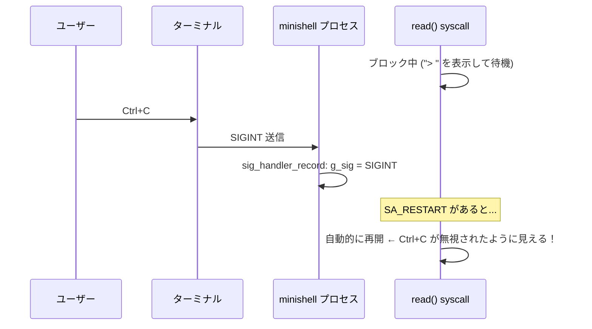
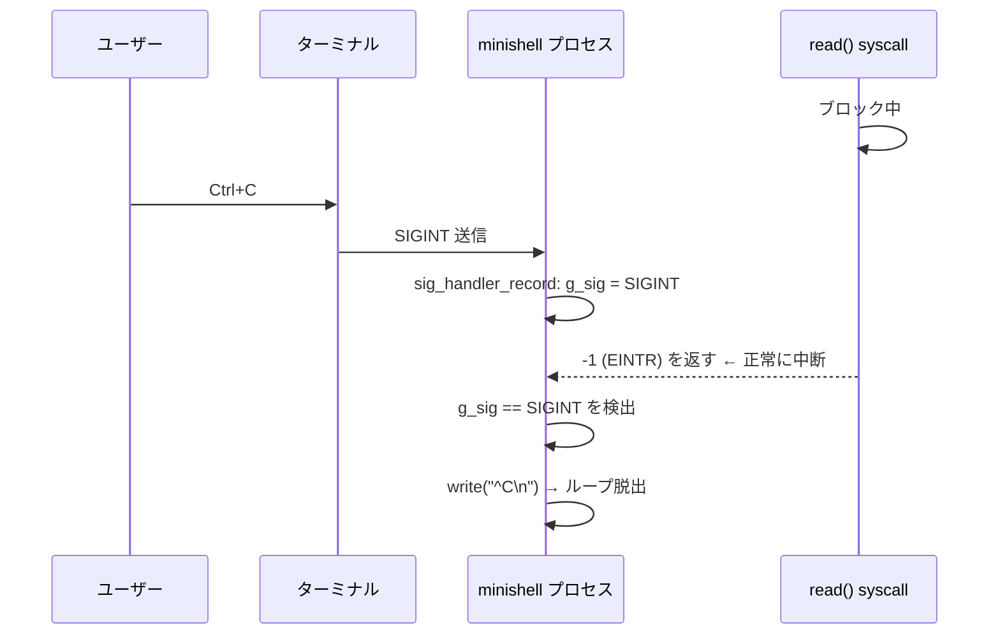
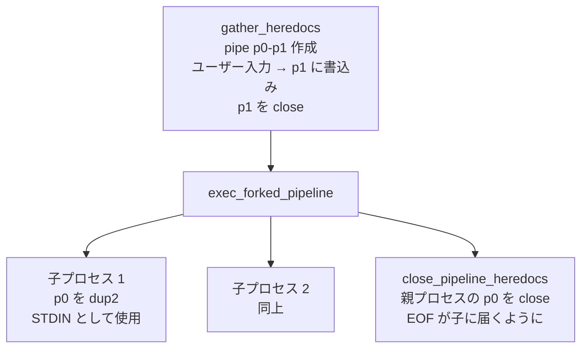

# Heredoc・シグナル処理 リファクタリング比較

## 概要

本ドキュメントは、`e498e1f` → 現在のコミット間で行われた heredoc とシグナル処理の修正・再設計をまとめたものです。

変更ファイル一覧:

| ファイル | 変更内容 |
|---|---|
| `src/core/ms.h` | `t_redirect` に `fd` フィールド追加、関数宣言追加 |
| `src/parser/parser_cmd.c` | `r->fd = -1` で初期化 |
| `src/exec/heredoc.c` | シグナル処理修正、EOF 警告追加、`gather_heredocs` 等を移動 |
| `src/exec/redirect.c` | heredoc を `r->fd` 参照に変更 |
| `src/exec/exec.c` | 実行前に `gather_heredocs` を呼ぶ |
| `src/exec/pipeline.c` | fork 後に `close_pipeline_heredocs` を呼ぶ |
| `src/signal/signal.c` | `signal()` → `sigaction()` (SA_RESTART なし) |

---

## 1. アーキテクチャの変化

### 以前: heredoc を apply_redirects 内で遅延オープン

以前の設計では、`apply_redirects` が各コマンドの実行直前に `heredoc_fd()` を呼んでいました。heredoc の収集（ユーザー入力）はパイプラインの fork・exec の中で行われていました。

```mermaid
sequenceDiagram
    participant Loop as ms_loop
    participant Exec as exec_pipeline
    participant Fork as exec_forked_pipeline
    participant Child as child_exec (fork後)
    participant Redir as apply_redirects
    participant Heredoc as heredoc_fd

    Loop->>Exec: exec_pipeline()
    Exec->>Fork: exec_forked_pipeline()
    Fork->>Child: fork() → child_exec()
    Child->>Redir: apply_redirects()
    Redir->>Heredoc: heredoc_fd() ← ここで初めてユーザー入力を読む
    Heredoc-->>Redir: pipe fd
    Redir-->>Child: dup2 完了
```

**問題点:**
- `child_exec` (fork後の子プロセス) の中でユーザー入力を読んでいた
- シグナルハンドラ (`sig_set_heredoc`) が呼ばれるタイミングが fork 後になる
- 親プロセスのシグナル状態との整合が取れない

### 現在: 実行前に一括収集 (gather_heredocs)

現在の設計では、`exec_pipeline` の先頭で全 heredoc の入力を収集してから、exec / fork に進みます。

```mermaid
sequenceDiagram
    participant Loop as ms_loop
    participant Exec as exec_pipeline
    participant Gather as gather_heredocs
    participant Heredoc as heredoc_fd
    participant Fork as exec_forked_pipeline
    participant Child as child_exec (fork後)
    participant Redir as apply_redirects

    Loop->>Exec: exec_pipeline()
    Exec->>Gather: gather_heredocs() ← 先に全heredocを収集
    Gather->>Heredoc: heredoc_fd() × 必要な数
    Heredoc-->>Gather: pipe fd (r->fd に保存)
    Gather-->>Exec: 完了 (または SIGINT で -1)
    Exec->>Fork: exec_forked_pipeline()
    Fork->>Child: fork() → child_exec()
    Child->>Redir: apply_redirects()
    Redir-->>Child: r->fd を dup2 (既にオープン済み)
    Fork->>Fork: close_pipeline_heredocs() ← 親側の fd を閉じる
```

---

## 2. シグナル処理の修正 (`signal.c`)

### 問題: `signal()` と `SA_RESTART`

```c
/* 以前 */
void sig_set_heredoc(void)
{
    g_sig = 0;
    signal(SIGQUIT, SIG_IGN);
    signal(SIGINT, sig_handler_record);  // ← SA_RESTART が暗黙的に設定される
}
```

Linux の glibc では `signal()` が内部的に `SA_RESTART` フラグを設定します。
`SA_RESTART` が有効だと、シグナルハンドラが返った後に `read()` が **自動的に再開** されます。



### 修正: `sigaction()` で `SA_RESTART` を外す

```c
/* 現在 */
void sig_set_heredoc(void)
{
    struct sigaction sa;

    g_sig = 0;
    signal(SIGQUIT, SIG_IGN);
    sa.sa_handler = sig_handler_record;
    sigemptyset(&sa.sa_mask);
    sa.sa_flags = 0;                    // SA_RESTART なし
    sigaction(SIGINT, &sa, NULL);
}
```

`SA_RESTART` なしで `SIGINT` が届くと、`read()` は `-1 (EINTR)` を返して中断されます。



---

## 3. `heredoc_fd()` の修正

### 問題1: `g_sig` が `sig_set_interactive()` でリセットされる

```c
/* 以前 */
close(p[1]);
sig_set_interactive();      // ← ここで g_sig = 0 にリセット！
if (g_sig == SIGINT)        // ← 常に false になる
    return (close(p[0]), sh->exit_code = 130, -1);
return (p[0]);              // ← SIGINT 後も p[0] を返してしまう
```

`sig_set_interactive()` の冒頭に `g_sig = 0;` があるため、SIGINT を検出する前にフラグが消えてしまっていました。

### 修正: `was_sigint` で事前に保存

```c
/* 現在 */
was_sigint = (g_sig == SIGINT);  // ← 先に保存
close(p[1]);
sig_set_interactive();           // g_sig がリセットされても問題なし
if (was_sigint)
    return (close(p[0]), sh->exit_code = 130, -1);
return (p[0]);
```

### 問題2: ループ内の条件分岐が一本化されていた

```c
/* 以前 */
line = read_heredoc_line();
if (!line || g_sig == SIGINT || !ft_strcmp(line, delim))
    break;
// ← SIGINT / EOF / delimiter を同一 break で処理
// ← SIGINT 時に line がリークする可能性
// ← EOF 警告なし、^C 表示なし
```

### 修正: 原因ごとに分岐

```c
/* 現在 */
line = read_heredoc_line();
if (g_sig == SIGINT)
{
    if (line)
        free(line);
    write(STDOUT_FILENO, "^C\n", 3);   // ^C を表示
    break;
}
if (!line)
{
    heredoc_eof_warning(delim);        // EOF 警告を stderr に出力
    break;
}
if (!ft_strcmp(line, delim))
{
    free(line);
    break;
}
```

---

## 4. EOF 警告の追加 (`heredoc_eof_warning`)

bash と同様に、delimiter に到達せず EOF (Ctrl+D) で heredoc が終了した場合、警告を出力します。

```c
static void heredoc_eof_warning(char *delim)
{
    write(STDERR_FILENO,
        "\nminishell: warning: here-document delimited"
        " by end-of-file (wanted `", 69);
    write(STDERR_FILENO, delim, ft_strlen(delim));
    write(STDERR_FILENO, "')\n", 3);
}
```

**出力例:**
```
minishell$ cat <<EOF
> hello
> (Ctrl+D を入力)

minishell: warning: here-document delimited by end-of-file (wanted `EOF')
hello
minishell$
```

---

## 5. `t_redirect` 構造体の変更

### 以前

```c
typedef struct s_redirect
{
    t_redirect_type     type;
    char               *target;
    bool                quoted;
    // fd フィールドなし ← heredoc は apply_redirects 時に都度オープン
    struct s_redirect  *next;
} t_redirect;
```

### 現在

```c
typedef struct s_redirect
{
    t_redirect_type     type;
    char               *target;
    bool                quoted;
    int                 fd;    // ← 追加: heredoc は事前にオープンして保存
    struct s_redirect  *next;
} t_redirect;
```

パーサーで `-1` に初期化し、`gather_heredocs` で実際の pipe fd が書き込まれます。

---

## 6. `apply_redirects` / `open_redirect` の変更

### 以前: `open_redirect` が heredoc をオープン

```c
static int open_redirect(t_shell *sh, t_redirect *r)
{
    if (r->type == REDIRECT_IN)     return open(r->target, O_RDONLY);
    if (r->type == REDIRECT_OUT)    return open_out(r->target, 0);
    if (r->type == REDIRECT_APPEND) return open_out(r->target, 1);
    return heredoc_fd(sh, r->target, r->quoted);  // ← ここで読み込み
}
```

### 現在: 既に開かれた `r->fd` を参照するだけ

```c
static int open_redirect(t_redirect *r)  // sh 引数が不要になった
{
    if (r->type == REDIRECT_IN)     return open(r->target, O_RDONLY);
    if (r->type == REDIRECT_OUT)    return open_out(r->target, 0);
    if (r->type == REDIRECT_APPEND) return open_out(r->target, 1);
    return r->fd;  // ← gather_heredocs で設定済みの fd を返すだけ
}
```

---

## 7. パイプラインの heredoc fd 管理

### fork 後の fd リーク防止 (`pipeline.c`)

複数プロセスに fork すると、全子プロセスが heredoc の読み取り端 (`p[0]`) を継承します。
親プロセスでは読み取り端が不要なので、fork 後に閉じる必要があります。

```c
/* 現在 pipeline.c */
if (fork_all(sh, pl, pids) != 0)
    return (free(pids), 1);
close_pipeline_heredocs(pl);  // ← 追加: 親の fd をここで閉じる
ret = wait_all(pids, pl->count);
```



---

## 8. 動作比較まとめ

| 操作 | 以前の動作 | 現在の動作 |
|---|---|---|
| `cat <<EOF` → Ctrl+C | 反応なし (`read()` が SA_RESTART で再開) | `^C` を表示してプロンプトに戻る (`exit_code=130`) |
| `cat <<EOF` → Ctrl+D | EOF で無言終了 | `warning: here-document delimited by end-of-file` を stderr に出力 |
| SIGINT 後の exit_code | `g_sig` がリセットされるため 130 にならないケースあり | `was_sigint` で確実に 130 をセット |
| heredoc 収集タイミング | `apply_redirects` (fork 後) | `exec_pipeline` の先頭 (fork 前) |
| `t_redirect.fd` | なし | `-1` で初期化、`gather_heredocs` で設定 |
